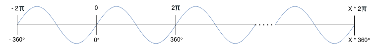
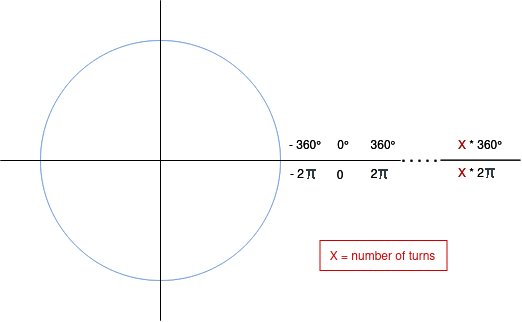
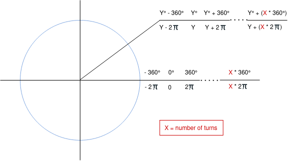
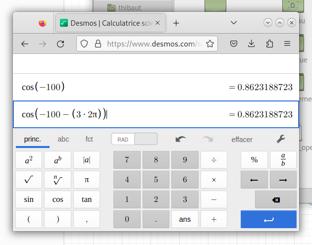

<center><h2><ins>Trigonometry</ins></h2></center>

<h3><ins>Basic functions</ins></h3>
Here is an implementation of the most basic trigonometric function, sines and cosines, using the Taylor series for both.

The difficulty was to make it work for arbitrary values (expecially large ones), the solution proposed here is to "cut" the amount of unite circle made in excess:

```c
float change_length(float number) {
    float two_pi = 6.283185;

    // If the input number is greater than 2*pi :
    // we will have to cut to the number of excess circles.

    // Count the number of revolutions made by the number:
    float number_circle = number / two_pi;

    // round down the number of circles made (put in an int)
    // and as this is the number of circles made
    // we have to remember it with "* two_pi"
    float number_circle_rounded_down = (int)number_circle * two_pi;

    // Cut the number of excess circles
    // if the input number is less than 2*pi
    // it will just do : number -= 0.0;
    number -= number_circle_rounded_down;

    return number;
}
```

The code is in radians, but it can also work in degrees by replacing 2 $\pi$ with $360°$ (they both represent one revolution of the unit circle):

```c
float change_length(float number) {
    //float two_pi = 6.283185;
    float two_pi = 360;

    float number_circle = number / two_pi;
    float number_circle_rounded_down = (int)number_circle * two_pi;
    number -= number_circle_rounded_down;

    return number;
}
```

Here how I find it :

<p align="center">
    
</p>

With a better representation to work with because of the periodicity :

<p align="center">
    
</p>

<p align="center">
    
</p>

Here are one of the few esample to demonstrate it (the others are in the exemples directory):

<p align="center">
    
</p>

$$number = Y+(X*2\pi)$$

We can find $Y$ with :
$$number - (X*2\pi) = Y$$

in the code :
```c
    number -= number_circle_rounded_down;
```

But We have still to find $X$, but since $X$ is the number of circles made, we can find it with by lowering it down by putting it in an int :
$$X = (int)number\_circle$$

that makes :
$$number - ((int)number\_circle*2\pi) = Y$$


$$number\_circle = (int)number\_circle*2\pi$$


$$number\_circle\_rounded\_down = (int)number\_circle * 2\pi$$

$$number - number\_circle\_rounded\_down = Y$$

inthe code :

```c
float change_length(float number) {
    float two_pi = 6.283185;

    float number_circle = number / two_pi;
    float number_circle_rounded_down = (int)number_circle * two_pi;
    number -= number_circle_rounded_down;

    return number;
}
```